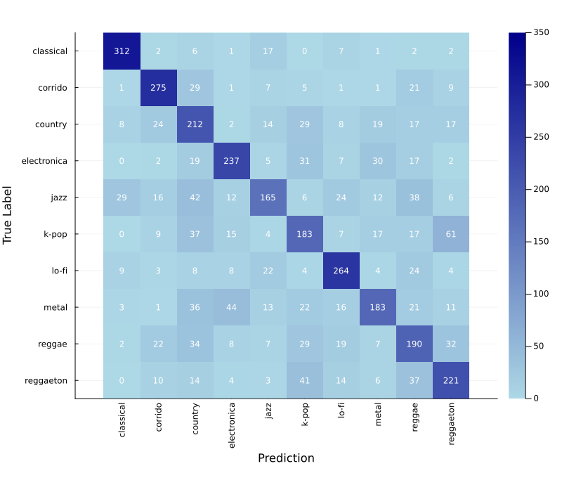
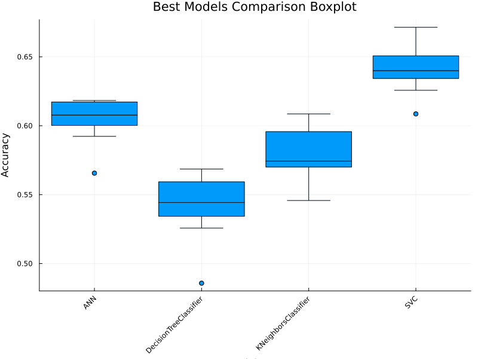
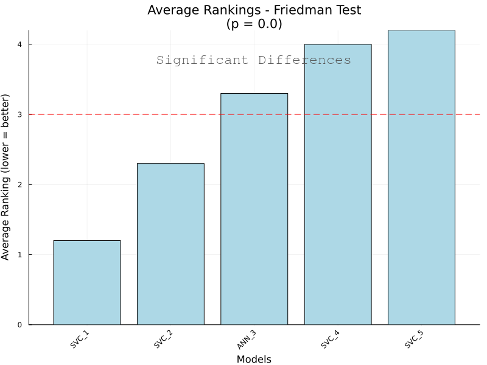

# 🎶 Music Genre Classification with Machine Learning  

[](https://julialang.org/)  
[](https://www.kaggle.com/datasets/tomigelo/spotify-audio-features)  

Classifying music genres using audio features and **classical machine learning models** 🎧.  
Originally developed as part of the *Fundamentals of Machine Learning* course, the project has been **translated into English** and **extended with statistical significance testing** to ensure more robust conclusions.  

---

## 🌟 Overview  
This project explores how audio features (tempo, energy, danceability, loudness…) can be used to predict music genres.  
We implemented and compared several classical ML models, and validated our findings not only with metrics but also with **statistical significance tests** ✅.  

---

## 🎼 Dataset  

### Overview
- **Source:** [Spotify Audio Features dataset](https://www.kaggle.com/datasets/tomigelo/spotify-audio-features)  
- **Original size:** ~100,000+ tracks  
- **Final dataset:** 3,500 balanced instances (350 per genre)
- **Genre labels:** Enriched using **Spotify Web API**  
- **Preprocessing:** ENN (Edited Nearest Neighbors) + Random Undersampling

### 🎵 Genres

The dataset includes **10 mutually exclusive genres** selected for their representativeness and diversity:

| Genre | Description | Example Artists |
|-------|-------------|-----------------|
| 🎻 **Classical** | Orchestral, symphonic, chamber music | Bach, Mozart, Beethoven |
| 🪕 **Corrido** | Mexican narrative ballads | Los Tigres del Norte |
| 🤠 **Country** | American folk, rural themes | Johnny Cash, Dolly Parton |
| 🎛️ **Electronic** | Synthesized, digital production | Daft Punk, Deadmau5 |
| 🎺 **Jazz** | Improvisation, swing, bebop | Miles Davis, John Coltrane |
| 🎤 **K-pop** | Korean pop, idol groups | BTS, BLACKPINK |
| 🌙 **Lo-fi** | Relaxed beats, downtempo | Nujabes, Jinsang |
| 🤘 **Metal** | Heavy guitars, aggressive | Metallica, Iron Maiden |
| 🌴 **Reggae** | Jamaican rhythms, offbeat | Bob Marley, Peter Tosh |
| 💃 **Reggaeton** | Latin urban, dembow rhythm | Daddy Yankee, Bad Bunny |

> **Note:** Genres were selected to avoid parent-child relationships (e.g., no "rock" alongside "metal").

---

### 🎚️ Audio Features

The dataset contains **17 features** describing each track:

#### Metadata
- **song** - Track title
- **artist** - Performing artist(s)
- **genre** - Musical genre (target variable)

#### Acoustic Properties
| Feature | Range | Description |
|---------|-------|-------------|
| **acousticness** | [0, 1] | Confidence that the track is acoustic |
| **danceability** | [0, 1] | How suitable the track is for dancing |
| **energy** | [0, 1] | Intensity and activity level |
| **instrumentalness** | [0, 1] | Likelihood of no vocals (higher = more instrumental) |
| **liveness** | [0, 1] | Probability of live performance |
| **loudness** | [-60, 0] dB | Average volume in decibels |
| **speechiness** | [0, 1] | Presence of spoken words |
| **valence** | [0, 1] | Musical positiveness/cheerfulness |

#### Musical Structure
| Feature | Type | Description |
|---------|------|-------------|
| **tempo** | BPM | Speed of the rhythm (beats per minute) |
| **key** | [0-11] | Pitch class (C, C#, D, ..., B) using standard Pitch Class notation |
| **mode** | {0, 1} | Major (1) or minor (0) tonality |
| **time_signature** | [1-5] | Estimated time signature (e.g., 4/4, 3/4) |
| **duration_ms** | ms | Track length in milliseconds |

#### Popularity
| Feature | Range | Description |
|---------|-------|-------------|
| **popularity** | [0, 100] | Global ranking score |

---

### 📊 Data Characteristics

**Statistical Summary of Key Features:**

| Feature | Min | Max | Mean | Std |
|---------|-----|-----|------|-----|
| acousticness | 0.0 | 0.996 | 0.351 | 0.346 |
| danceability | 0.0 | 0.983 | 0.587 | 0.175 |
| energy | 0.0 | 0.999 | 0.588 | 0.264 |
| tempo | 0.0 | 239.6 | 119.5 | 30.9 |
| loudness | -60.0 | 0.636 | -9.35 | 6.37 |
| valence | 0.0 | 0.999 | 0.501 | 0.267 |

**Key Observations:**
- Wide feature ranges reflect creative diversity within genres
- High overlap between genre distributions → challenging classification task
- Correlations: `energy ↔ loudness` (0.76), `energy ↔ acousticness` (-0.65)

---

### 🔄 Preprocessing Pipeline

1. **Genre Enrichment** - Retrieved using Spotify Web API
2. **Genre Selection** - Top 10 mutually exclusive genres
3. **Instance Reduction** - Applied ENN to remove noisy/outlier instances
4. **Balancing** - Random undersampling to 350 instances per genre
5. **Normalization** - Applied within each CV fold (see Section 4.1 in report)

**Files in `data/`:**
- `spotify_dataset.csv` - Final preprocessed dataset (3,500 instances)
- `cv_indices.jl` - Pre-generated 10-fold CV splits for reproducibility

---

## 🛠️ Methods  
Models implemented:  
- ⚡ Support Vector Machine (SVM)  
- 🔎 k-Nearest Neighbors (kNN)  
- 🌳 Decision Trees  
- 🧠 Artificial Neural Networks (ANN)  
- 🎲 DoME (Developement of Mathematical Expressions)  

**Pipeline:**  
1. Data preprocessing  
2. Cross-validation training  
3. Evaluation (accuracy, F1-score, confusion matrices)  
4. Statistical significance testing (Friedman + Wilcoxon post-hoc)  

---

## 📊 Results   
- Best model: **SVM with Poly kernel, degree=2, C=1, gamma=0.1**  
- Accuracy: **64.06%**  
- F1-score: **0.6400**  


[](results/figures/evaluation/best_svm_confusion.png)  

[](results/figures/evaluation/models_boxplot.png)  


---

## ⚖️ Statistical Analysis  
To ensure results were not due to chance, we applied:  
- **Friedman test** to detect overall differences across models  
- **Wilcoxon post-hoc tests** for pairwise comparisons  

[](results/figures/evaluation/friedman_rankings.png)

---

## 🔹 Repository Structure  

```
music-genre-classification/
│
├── src/
│   ├── main.jl                # Runs the full pipeline from data loading to evaluation
│   ├── eda.jl                 # Performs exploratory data analysis
│   ├── models.jl              # Defines all ML models
│   ├── trainer.jl             # Facilitates experimentation and results management 
│   ├── evaluation.jl          # Computes metrics and plots confusion matrices
│   └── stats_tests.jl         # Performs Friedman + Wilcoxon post-hoc tests
│
├── data/
│   ├── spotify_dataset.csv    # Main dataset
│   └── cv_indices.jl          # Cross-validation indices for reproducibility
│
├── results/
│   └── figures/               # Plots and tables generated
│
├── report/
│   └── full_report.pdf        # Detailed report
│
└── README.md                  # This file
```
---


**Brief explanation of each module:**  
- **main.jl** – Runs the full pipeline from loading data to model evaluation and plotting.  
- **eda.jl** – Contains the functions that perform Exploratory Data Analysis on the dataset.  
- **models.jl** – Creates all the necessary infraestructure to create, train and evaluate models built on MLJ, also performs normalization (on every fold).  
- **trainer.jl** - Wrapper to facilitate experiments executions and result managing.
- **evaluation.jl** – Plots confusion matrices and build tables.  
- **stats_tests.jl** – Performs statistical tests (Friedman + Wilcoxon) to validate results.  

---

## 📝 Full Report  
The report includes:  
- Related work  
- Dataset creation and enrichment process  
- Exploratory Data Analysis (EDA)  
- Preprocessing steps and rationale  
- Model evaluation and result discussion  
- Ideas for future work  

Check the `report/full_report.pdf` for the full document 📄.  
We strongly encourage readers to check the full report for completeinformation about this project.

---

## 💻 How to Run  
Clone the repository and install dependencies:  

```bash
git clone https://github.com/yourusername/music-genre-classification.git
cd music-genre-classification
julia --project
using Pkg; Pkg.instantiate()
julia src/main.jl
```

Used Julia version: v1.11.3

### ⚠️ Important: Execution Time

Running **all experiments** (full hyperparameter grid search + 10-fold CV for all models) takes approximately **~4 hours** on a standard laptop, execution is quick **~5 minutes** if we exclude ANN and DoME.

However, all of the experiment results are in  the folder /results and are available on this repository.


---

## 📌 Notes & Considerations

- **Educational purpose:** Developed for the *Fundamentals of Machine Learning* course
- **Reproducibility:** All experiments use fixed random seeds and CV indices
- **Limitations:** 
  - Spotify features may not capture all genre nuances
  - Some genres show significant overlap (e.g., jazz vs lo-fi)
  - Dataset reduced to 3,500 instances due to computational constraints
  - This code does not support GPU execution

💡 **Future work ideas:**
- Incorporate audio signals (spectrograms, MFCCs)
- Test deep learning architectures (CNNs, Transformers)
- Explore multimodal approaches (lyrics + audio + metadata)